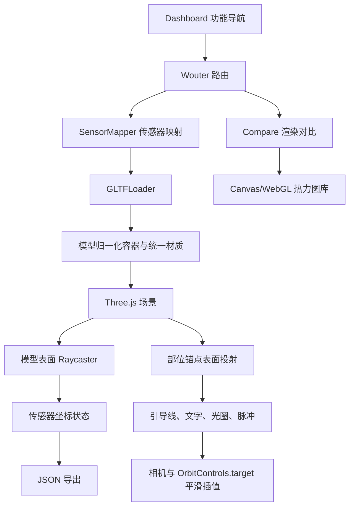

# 项目架构文档

> 本文档记录 HeatMap Lab 的当前实现。最后更新于：2026-08-06

## 1. 项目概览

HeatMap Lab 是一个基于浏览器的热力图渲染与传感器映射工具集。前端提供多种 2D/WebGL/Three.js 热力图对比、人体与手套 GLB 展示，以及可在模型表面放置、微调和导出传感器坐标的 3D 映射工具。生产服务端仅负责静态资源与 SPA 路由回退；开发环境由 Vite 提供模型存储代理和调试日志收集。

## 2. 技术栈

| 分类       | 技术                                    | 版本/说明                                        |
| :--------- | :-------------------------------------- | :----------------------------------------------- |
| 前端框架   | React                                   | 19.2，函数组件与 Hooks                           |
| 路由       | Wouter                                  | 3.7                                              |
| 3D 渲染    | Three.js                                | 0.185，原生命令式场景；GLTFLoader、OrbitControls |
| 数据可视化 | Canvas 2D、WebGL、Recharts、Google Maps | 热力图渲染与对比                                 |
| UI 与样式  | Tailwind CSS、Radix UI                  | 深色数据可视化界面                               |
| 动画       | Three.js RAF、Framer Motion             | 3D 标注与常规 UI 动画                            |
| 后端框架   | Express                                 | 4.21，生产静态文件服务                           |
| 编程语言   | TypeScript / TSX                        | TypeScript 5.6，strict 模式                      |
| 构建工具   | Vite、esbuild                           | 客户端与服务端分别打包                           |
| 包管理器   | pnpm                                    | 锁文件版本 10.x                                  |
| 数据库     | 无                                      | 传感器映射数据保存在浏览器状态并导出 JSON        |

## 3. 目录结构

```text
heatmapAndModal/
├─ client/
│  ├─ public/                 # 浏览器静态资源与调试脚本
│  ├─ index.html              # Vite HTML 入口
│  └─ src/
│     ├─ components/          # 通用组件、地图组件和 UI 基础组件
│     ├─ contexts/            # 主题上下文
│     ├─ hooks/               # 通用 React Hooks
│     ├─ lib/                 # 热力图算法、示例数据与工具函数
│     ├─ pages/
│     │  ├─ Dashboard.tsx     # 功能导航页
│     │  ├─ Compare.tsx       # 2D/WebGL/Three.js 渲染对比
│     │  ├─ SensorMapper.tsx  # GLB 传感器映射与 3D 部位标注
│     │  └─ NotFound.tsx      # 404 页面
│     ├─ App.tsx              # 路由与全局 Provider
│     └─ main.tsx             # React 挂载入口
├─ server/
│  └─ index.ts                # Express 生产静态服务器
├─ shared/
│  └─ const.ts                # 前后端共享常量
├─ patches/                   # pnpm 依赖补丁
├─ package.json               # 脚本与依赖声明
├─ tsconfig.json              # 客户端/服务端共享类型检查配置
└─ vite.config.ts             # Vite、存储代理与开发日志插件
```

## 4. 核心模块与数据流

### 4.1 模块关系



### 4.2 传感器映射数据流

1. 用户拖入或选择 GLB/GLTF；预设模型通过开发存储代理加载。
2. `installModel` 先校验包围盒，再用外层 `Group` 把模型最大边归一化为 8 个世界单位，保留原 GLTF 根变换。
3. 点击模式通过摄像机射线获取模型表面交点；矩阵和区域批量模式按配置生成多条射线。
4. 传感器点同时写入 Three.js `markerGroup` 和 React `sensors` 状态。
5. 导出时按区域和扁平列表两种结构生成 `sensor_positions.json`。

### 4.3 3D 部位标注与相机聚焦

- 人体 profile 提供背部、胸部、手臂、腿部、手掌 5 个预设；手套 profile 提供手掌与五指 6 个预设。
- 每个预设包含包围盒归一化锚点、引导线朝向、摄像机方向和按模型尺寸计算的距离。
- 锚点从包围盒外向模型射线投射，命中真实表面后创建引导线、小型发光点、透明扩大命中区、文字 Sprite、内圈与脉冲外圈。
- 主渲染循环统一驱动 billboard 朝向、脉冲缩放/透明度、悬停高亮和相机插值；快速连点只保留最新目标，手动 OrbitControls 操作会取消当前插值。
- 背向摄像机的标注会隐藏并退出命中检测，避免穿模点击；右上角 DOM 部位按钮提供键盘等价入口。
- `prefers-reduced-motion` 开启时停止循环脉冲，并把相机切换改为立即完成。
- 模型加载使用递增 generation 防止旧请求覆盖新请求；换模和卸载会清理几何体、材质、纹理、RAF、控制器和过期模型。

## 5. 路由与端点

### 5.1 前端路由

| 路径       | 页面           | 说明                     |
| :--------- | :------------- | :----------------------- |
| `/`        | `Dashboard`    | 工具导航                 |
| `/compare` | `Compare`      | 热力图和 3D 模型渲染对比 |
| `/mapper`  | `SensorMapper` | 传感器映射与 3D 部位标注 |
| `/404`     | `NotFound`     | 显式 404 页面            |
| 其他       | `NotFound`     | 前端兜底路由             |

### 5.2 服务端与开发中间件

| 方法   | 路径                  | 环境             | 说明                                         |
| :----- | :-------------------- | :--------------- | :------------------------------------------- |
| `POST` | `/__manus__/logs`     | Vite 开发环境    | 收集浏览器日志并写入 `.manus-logs`           |
| `GET`  | `/manus-storage/:key` | Vite 开发环境    | 获取 Forge 存储签名地址并 307 跳转           |
| `GET`  | `*`                   | Express 生产环境 | 返回 `dist/public/index.html`，支持 SPA 路由 |

当前没有业务 REST API 或数据库写入端点。

## 6. 外部依赖与集成

| 服务/库           | 用途                    | 集成方式                         |
| :---------------- | :---------------------- | :------------------------------- |
| Forge Storage     | 人体/手套预设 GLB       | Vite `/manus-storage` 开发代理   |
| Google Maps       | 地图热力图对比          | 浏览器端 Forge Maps API 配置     |
| Three.js examples | GLTF 加载和轨道相机控制 | 动态 import                      |
| Umami/分析占位    | 页面分析                | `client/index.html` 环境变量占位 |

## 7. 环境变量

| 变量名                        | 使用位置              | 说明                               |
| :---------------------------- | :-------------------- | :--------------------------------- |
| `NODE_ENV`                    | Vite / Express        | 区分开发与生产模式                 |
| `PORT`                        | Express               | 生产服务端口，默认 3000            |
| `BUILT_IN_FORGE_API_URL`      | Vite                  | Forge 服务基础地址                 |
| `BUILT_IN_FORGE_API_KEY`      | Vite                  | 服务端存储代理凭据，不暴露到浏览器 |
| `VITE_FRONTEND_FORGE_API_URL` | `Map.tsx`             | 浏览器地图服务地址                 |
| `VITE_FRONTEND_FORGE_API_KEY` | `Map.tsx`             | 浏览器地图服务 key                 |
| `VITE_OAUTH_PORTAL_URL`       | `client/src/const.ts` | OAuth 门户地址                     |
| `VITE_APP_ID`                 | `client/src/const.ts` | OAuth 应用 ID                      |
| `VITE_ANALYTICS_ENDPOINT`     | `client/index.html`   | 分析脚本地址，可选                 |
| `VITE_ANALYTICS_WEBSITE_ID`   | `client/index.html`   | 分析站点 ID，可选                  |

## 8. 项目进度

| 完成日期   | 完成的功能/工作           | 说明                                                                    |
| :--------- | :------------------------ | :---------------------------------------------------------------------- |
| 2026-08-06 | 多渲染器热力图对比        | 已具备 Google Maps、Canvas、WebGL 与 Three.js 展示入口                  |
| 2026-08-06 | 传感器映射基础能力        | 支持 GLB/GLTF、点击标注、区域批量、矩阵贴敷、微调与 JSON 导出           |
| 2026-08-06 | 3D 部位标注与预设视角     | 完成引导线、文字、光圈、脉冲、可点击命中区和相机平滑聚焦                |
| 2026-08-06 | 模型 profile 与交互健壮性 | 区分人体/手套标注，处理换模竞态、资源释放、遮挡、键盘入口与减弱动画偏好 |

## 9. 更新日志

| 日期       | 变更类型 | 描述                                                        |
| :--------- | :------- | :---------------------------------------------------------- |
| 2026-08-06 | 初始化   | 创建项目架构文档并记录现有模块、路由和数据流                |
| 2026-08-06 | 新增功能 | 在传感器映射工具中完善 Apple 风格 3D 部位标注和相机平滑聚焦 |

## 10. 验证

- `pnpm check`：通过。
- `pnpm exec tsc -p tsconfig.node.json --incremental false`：通过。
- `pnpm build`：通过；保留既有的分析变量、混合 import 与大 chunk 警告。
- 浏览器 `/mapper`：使用本地 GLTF 验证模型加载、标注显示、脉冲、DOM 部位入口、3D 光圈点击、聚焦完成状态和“点击标注不误加传感器点”。

---

具体实现细节以源码为准；修改核心模块、数据流、端点或环境变量时应同步更新本文档。
